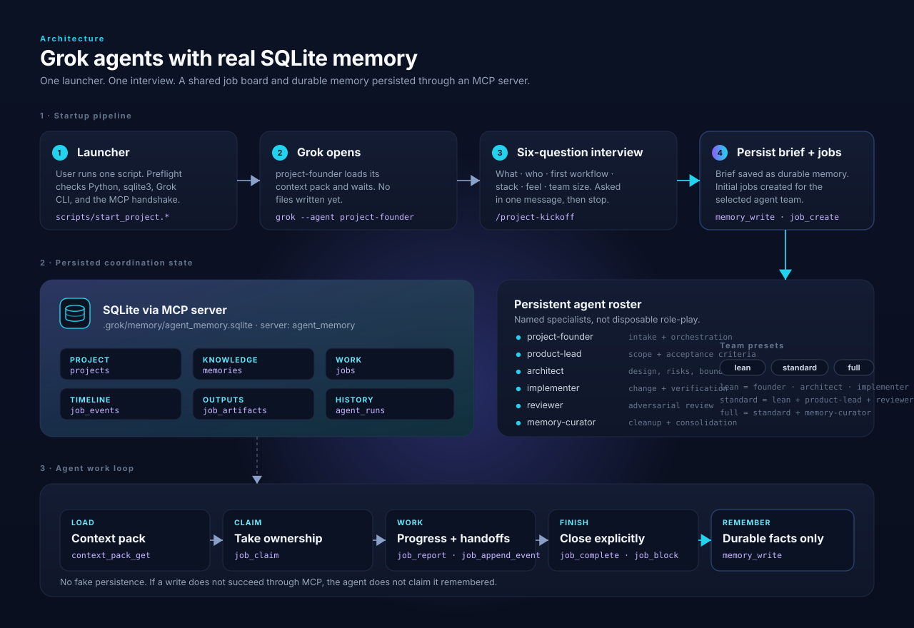
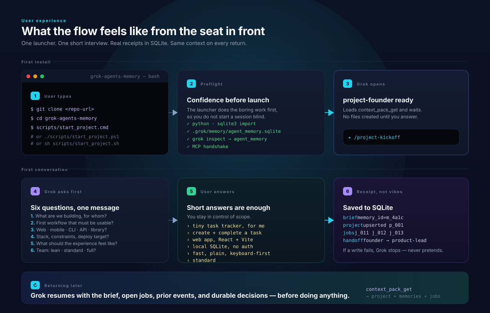

# Grok CLI Agents With SQLite Memory

This workspace wires Grok Build to a real SQLite-backed memory layer through a
project-scoped MCP server. The same MCP server also contains a real SQLite job
board so persistent agents know what to read, claim, update, and report back to.



## User Experience



## What Is Real Here

- MCP server: `mcp/sqlite_memory_server.py`
- Database: `.grok/memory/agent_memory.sqlite`
- Grok wiring: `.grok/config.toml`
- Agent profiles: `.grok/agents/*.md`
- Project rules: `AGENTS.md`
- Job board tables: `projects`, `jobs`, `job_events`, `job_artifacts`,
  `agent_runs`

The database is ignored by git because it may contain private project memory,
but it is created locally and used by the MCP server.

## Prepare The Agent Memory

```powershell
python scripts/ensure_memory.py
```

This checks that Python's `sqlite3` works, creates the local database if it is
missing, seeds the persistent agent profiles, creates the default project record,
and adds the core project memories idempotently.

## Verify The Memory Server

```powershell
python tests/test_sqlite_memory_server.py
grok inspect
```

`grok inspect` should show the project MCP server named `agent_memory`.

## Start Grok With Memory

```powershell
grok --experimental-memory --agent project-founder
```

For an empty project, `project-founder` should question you before scaffolding,
then persist project facts and agent history through the SQLite MCP tools.

You can also invoke the kickoff workflow directly inside Grok:

```text
/project-kickoff
```

Or use the launcher that supplies the opening prompt for you:

```powershell
.\scripts\start_project.ps1
```

If PowerShell execution policy blocks scripts, use the cmd wrapper:

```cmd
scripts\start_project.cmd
```

On macOS/Linux:

```bash
sh scripts/start_project.sh
```

The launcher checks/creates SQLite memory first, verifies the Grok MCP server,
then starts Grok. When Grok opens, type:

```text
/project-kickoff
```

The kickoff flow asks six short questions first, saves the resulting brief to
SQLite, creates initial job-board items, then coordinates the selected agent
team:

- lean: founder, architect, implementer
- standard: lean plus product lead and reviewer
- full: standard plus memory curator

## Agent Coordination Contract

Agents use the SQLite MCP tools as their operating layer:

1. `context_pack_get` - load profile, project, memories, assigned jobs, open jobs.
2. `job_claim` - claim a job before substantial work.
3. `job_report` or `job_append_event` - report progress, handoffs, and blockers.
4. `job_complete` or `job_block` - end the job explicitly.
5. `memory_write` - save only durable facts that should survive future sessions.

The job board is current work state. Memory is long-term knowledge.

## Check Without Opening Grok

Windows:

```powershell
.\scripts\start_project.ps1 -CheckOnly
```

Windows cmd:

```cmd
scripts\start_project.cmd -CheckOnly
```

macOS/Linux:

```bash
sh scripts/start_project.sh --check-only
```
